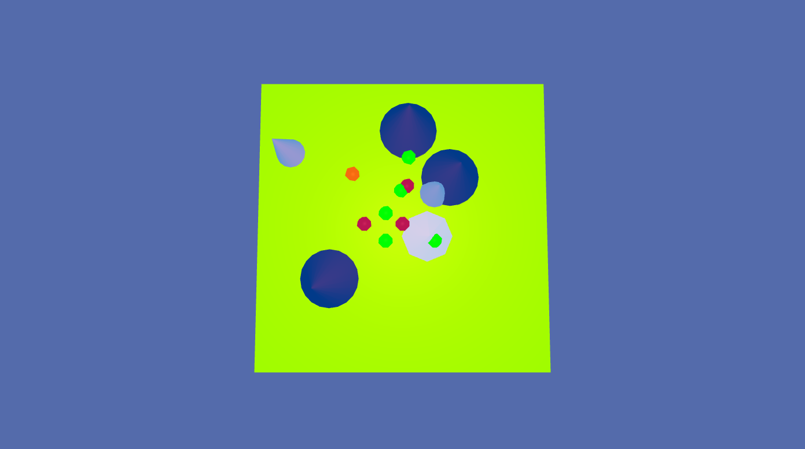
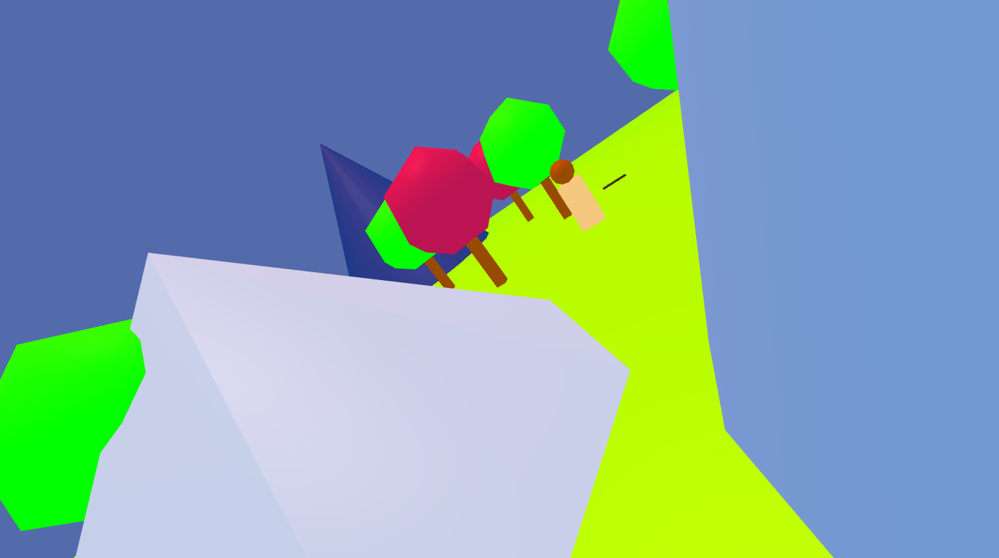
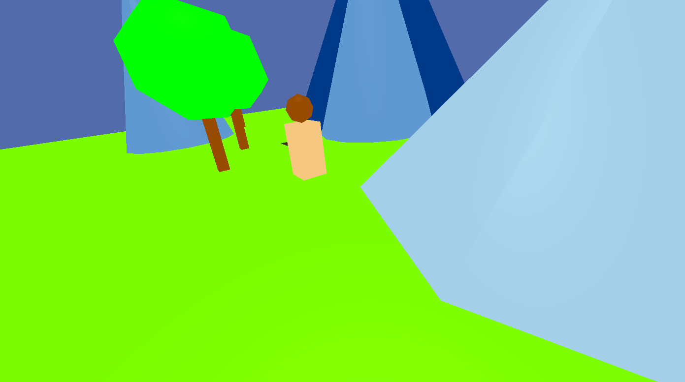

# park-creation-3d

**park-creation-3d** is 3D-based website to make a 3D park on the website.

## Core feature(s)
- Add object on your own (such as trees, mountains, etc.).
- Control human using <kbd>W</kbd>, <kbd>A</kbd>, <kbd>S</kbd>, <kbd>D</kbd>

## Language feature(s)
- HTML, CSS, and Vanilla JavaScript
- Three.js (JS library to generate and render 3D interface)

## DEMO
[daimessdn.github.io/park-creation-3d](https://daimessdn.github.io/park-creation-3d)

